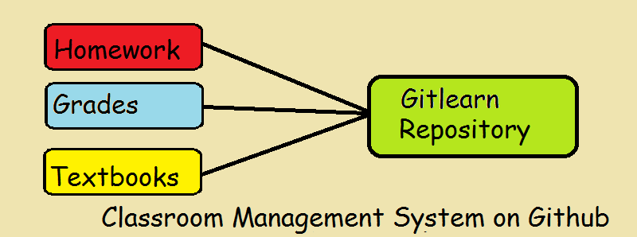
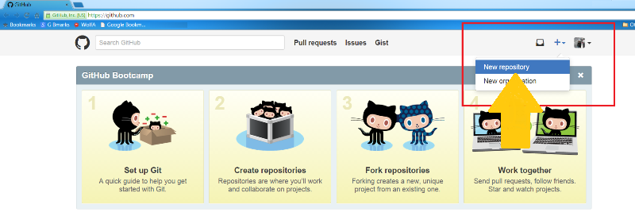
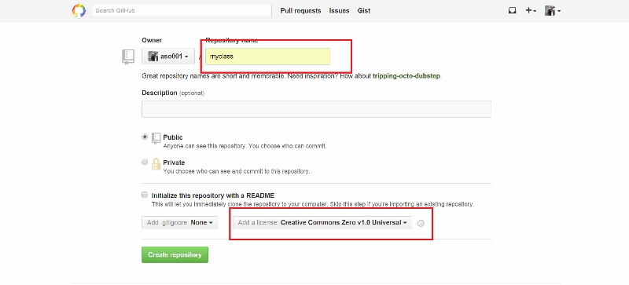
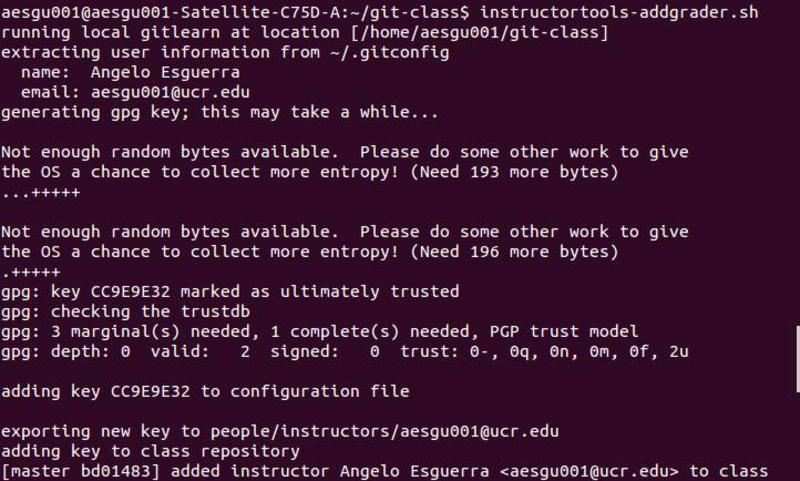

#Setup a Repository for Your Class with Gitlearn

This is a common repository software that instructors would use regularly.
This information covers how to setup your own data management system that would hold student grades, homework assignments, and textbook references for your class.
This software should be run on a Linux or Mac based machine.



###Installing Procedures

####Step 1: Register a new account on Github.

- You may skip this step if you already have a Github account.
- To create a new account, you need to fill out a signup form with your `USERNAME`, `EMAIL ADDRESS`, and `PASSWORD` after clicking on the following link: [github.com](https://github.com).
- Once you finish registering your personal information, click on the big green "Sign up for Github" button.


####Step 2: Create a repository on Github with your class name.

- On the top right hand corner,
  1. Click on the '+' sign to bring down the selection menu.
  2. Click on the `New Repository` button with the pull-down menu.



- Type in the name of your class in the 'Repository name' section such as "myclass" or "ucr-cs100".
- Set 'Creative Commons Zero v1.0 Universal' in the 'Add a license' section for more flexibility.



####Step 3: Clone a mirror image of your repository to your local machine.

- Open up a local terminal.
- Type the following commands in sequence:
```
$ git clone https://github.com/instructorjdoe001/myclass
$ cd myclass
$ git clone https://github.com/mikeizbicki/gitlearn
$ echo "export PATH=$(pwd)/gitlearn/scripts:"'$PATH' >> $HOME/.bashrc
```
**NOTE:**
The fourth command makes it easier to run the Gitlearn scripts on the terminal.

####Step 4: Configure your Gitlearn settings with your class name.

Use the following commands to change the label from `classname="ucr-cs100"` to `classname="yourclassname"`.
```
$ sed -i -e 's/ucr-cs100/yourclassname/' .gitlearn/scripts/config.sh
```

####Step 5: Setup directory folders for your class.
- This directory will hold all the class assignments.
```
$ mkdir assignments
```
- This directory will hold the instructor and student information for the class.
```
$ mkdir people
$ mkdir people/students
$ mkdir people/instructors
```

####Step 6: Synchronize your local repository with Github.

```
$ git add --all
$ git commit -m "Initial Classroom commit"
$ git push origin master
```

####Step 7: Create assignment folders in your repository.

After setting up your classroom repository, you can make assignment directories store grades for the class.
For example, you can run the following commands in the `assignments` directory folder.
```
$ mkdir assn1
```
- The `grade` file will store the assignment grade.
```
$ echo /100 >> ./assn1/grade
```
- The `README.md` file will hold the assignment specification which can be edited on a later date.
```
$ touch ./assn1/README.md
```
```
$ git add --all
$ git commit -m "Adding assn1"
$ git push origin
```
**NOTE:**
- You can add sub-folders into the `assignments` directory for different categories, such as labs.
- You can change an assignment's total grade in this directory.
- See [`grades.md`](grades.md) for further details on how grades are stored in Gitlearn.

####Step 8: Add instructor verification keys.

You should add instructor keys to verify student grades.
On the home directory of the class repository, run:
```
$ instructortools-addgrader.sh
```


**NOTE:**
This process takes more than 15 minutes to complete.

**IMPORTANT:**
Make sure the key is generated in the computer that you always use because the key is part of the verification system.

####Step 9: Add students to your class.

There are two ways to enroll students in your class.
The first one is to have them carefully read and follow the instructions provided by the [`Enrolling.md`](Enrolling.md) file.
Otherwise, you can add them yourself by entering the following commands for each student information and generate student files:
```
echo name = Example Student1 > ./people/students/student001
echo giturl = https://github.com/student001/myclass >> ./people/students/student001
echo github = student001 >> ./people/students/student001
git add --all
git commit -m "enrolling student001 in myclass"
git push origin
```
**IMPORTANT:**
Be sure to let the students create Github accounts, if they do not have one yet, and fork your class repository first if you proceed with the second option.

###Congratulations! You have completed a basic repository setup.
----------------------------------------------------------------------------------------
#Operating the Gitlearn Repository

###Update Assignment Grades
The `gradeassignment-all.sh` script lets you update the assignment grade for the whole class.
The script requires an appropriate assignment sub-path as a parameter.
You would run the following command:
```
$ gradeassignment-all.sh assignments/assn1/
```
**NOTE:**
The script will pull a local copy of each student's repository and check for the existence of the assignment.
It will be opened up with a vim editor to edit individual student grades on a spreadsheet like this:


**NOTE:**
The spreadsheet will show if the assignment was previously graded and signed.
After saving the score on the editor, the script will look for the instructor key to verify and sign the commit.
The updated grades will then be pushed to each student repository.

###Grade Individual Assignments
The `gradeassignment-individual.sh` script grades an assignment for a specific student.
It requires two parameters: the student's Github account and the assignment sub-path.
```
$ gradeassignment-individual.sh test003 assignments/assn1/
```
Like the `gradeassignment-all.sh` script, this script will also pull a local copy of the student's repository and check whether the assignment exists.
It will open up the grade file for the instructor to assign a grade and provide feedback.
```
5/10

Part 1 :5 /10
  [ /2.5] test a
  [ /2.5] test b
  [0 /5.5] test c
  [0 /5.5] test d
```

**NOTE:**
Tests with blank scores mean those portions have full points.

###View Grades
To view all student grades, run:
```
$ instructortools-viewallgrades.sh
```
This script will pull local copy of each student repository and display all the names and the overall scores in a table.


To check the grade of an individual student, the following script should be used:
```
$ calcgrade.sh test003
```
**NOTE:**
If you run the `instructortools-viewallgrades.sh` script for the first time, the script will need to clone a local repository of each student.
In addition, you will have to run the script again to eliminate the incorrect grades that appear after the first run.
