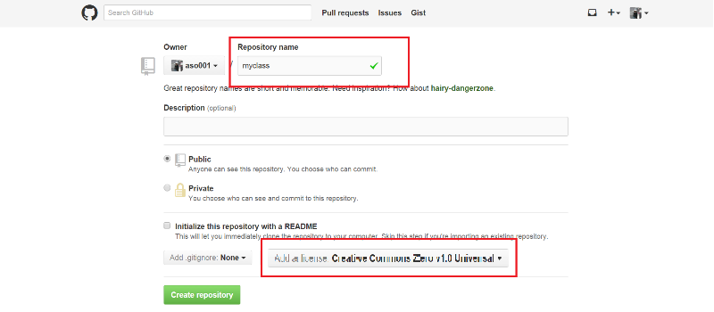
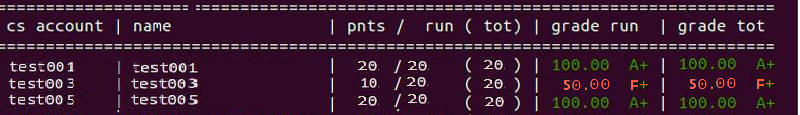

#Setup a Database for Your Class with Gitlearn

This is a common database software that instructors would use regularly. 
This information will cover how to setup your data management system that would hold student grades, homework assignments, and textbook references for your class that you can manage when needed.
This software should be run on a Linux or Mac based machine.  
 

###Installing Procedures

#####Step 1: Register a new account on Github. 
  - To create a new account for a new Database, you need to fill out a signup form with your USERNAME, EMAIL ADDRESS, and PASSWORD after clicking on the following link: [github.com](https://github.com)  
    
  **NOTE:** Once registered your personal information, click on the big GREEN  "Sign up for Github" button to finish.    

#####Step 2: Create a database on Github with your classname.   
  - Once registered, on the top right hand corner,  
  a.) Click on the '+' sign to bring down the selection menu.   
  b.) Click on the `New Respository` button with the pull-down menu.    
    
  c.) Type the name of your class in the 'Respository Name' section such as "myclass" or "ucla-ENGL1C".  
  d.) Set 'BSD 3-clause' in the licensing section for more flexibility.  
  **NOTE:** Steps C and D are shown in the picture as followed.  
   

#####Step 3: Build a mirror image of your database to your local machine. 
 a.) Open up a local terminal.  
 b.) Type the highlighted commands in sequence as followed:  
 ```
 $ git clone https://github.com/instructorjdoe001/myclass    
 $ cd myclass
 $ git clone https://github.com/mikeizbicki/gitlearn  
 $ echo "export PATH=$(pwd)/gitlearn/scripts:"'$PATH' >> $HOME/.bashrc 
 ```
#####Step 4: Config your Gitlearn Settings with your Classname.  
 a.) Use following commands to change the label from `classname="ucr-cs100"` to `classname="yourclassname"`.  
 ```
 $ cd gitlearn/scripts
 $ sed -i -e 's/ucr-cs100/yourclassname/' ./config.sh
 ```

#####Step 5: Setup Directory folders for the Class with your computer.
 ```
 $ cd -
 $ mkdir assignments
 $ mkdir people
 $ cd people
 $ mkdir students
 $ mkdir instructors
 
 ```
#####Step 6: Sychronize your local Database with Github.  
 ```  
 $ git add --all
 $ git commit -m "Intial Classroom commit"  
 $ git push origin  
 
 ```
 
###Adding Instructor Verification Keys

After setting up and installing your classroom database, you should add instructor keys to verify student grades.
On the home directory of the class database, run:
```
$ instructortools-addgrader.sh
```


**NOTE:**
This process takes more than 15  minutes to complete.  

**IMPORTANT:**
Make sure the key is generated in the computer that you always use because the key is part of verification system.

###Create Assignment Folders in your Database.
After setting up your classroom database, you can make assignment directories to store grades for the class.
For example, you can run the following commands in the `assignments' directory folder.  
```
$ mkdir assn1
$ cd assn1
$ echo /100 >> grade
$ touch README.md
$ git add --all
$ git commit -m "Adding assn1"
$ git push origin
```
**NOTE:** 
+ You can add subfolders into the `assignments` directory for different type of assignments and categories.  
+ You can update a score or grade in this directory.  

## Congratulations! You complete a basic database setup.  
----------------------------------------------------------------------------------------
## The following sections are used to operate a database:

###Update Assignment Grades
The `gradeassignment-all.sh` script is for updating the assignment score for the whole class.
The script requires an appropiate assignment subpath[assn1] as a parameter.
You would run the following command:
```
$ gradeassignment-all.sh assignments/assn1/
```
**NOTE:** assn1 can be represented as assignment 1, 2, 3, and so on.    
The script will pull a local copy of each student's database and check for the existence of the assignments.
It will be opened up with a vim editor to edit individual student grades on  a spreadsheet as followed:


**NOTE:**
The "spreadsheet" will show if the assignment was previously graded and signed.
After saving the score on the editor, the script will look for the instructor key to verify and sign the commit.
The updated grades will then be pushed to each student database.

####Grading Individual Assignments
The `gradeassignment-individual.sh` script is to grade an assignment for a specific student. It will require an additional parameters to run: 
```
$ gradeassignment-individual.sh jdoe001 assignments/assn1/
```
Similar to the `gradeassignment-all.sh` script, this script will pull a local copy of the student's database and check for the assignments.
This function might be used more often as it lets the grader provide individual feedback for a student.
It will be opened up with a blank page in the vim editor for updating grades.
The script will automatically push the grades to the student database as an update.

###View Grades
To view all student grades, the following script should be run:
```
$ instructortools-viewallgrades.sh
```
This script will pull local copy of each student database and display all the names and the overall scores in a table.

  

For checking the detailed grades of an individual student, the following script should be used:
```
$ calcgrade.sh jdoe001  
```
**NOTE:**
If the script `instructortools-viewallgrades.sh` is used for the first time, the script will need to clone a local database of each student.  
In addition, the script will be run again to eliminate the incorrect grades that occur during the first run.


###Additional tools/resources

[`runtests.md`](runtests.md) - semi-automatic grading script  
[`grades.md`](grades.md) - detailed explaintion on how grades in gitlearn work
