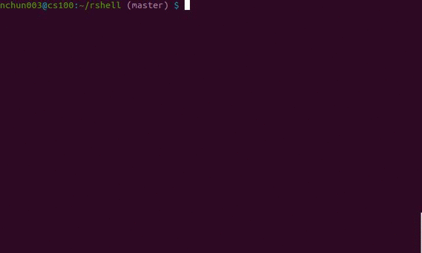

# system call error checking

It is crucial for your `.c`/`.cpp` files to perform error checking on every system call ("syscall" for short) they employ.
Without proper error checking, when you run your program and one or more syscall returns a number that indicates an error,
say `-1`, your program would likely crash.
To do an error checking on a syscall, you would include the `stdio.h` library to utilize the `perror` function inside the conditional statement when the syscall returns an error value:
```
	if (-1==execvp(argv[0],argv)) {
		perror("execvp");
		exit(1);
	}
```
It is also good practice to pass in the name of the corresponding syscall as `perror`'s argument.
It would help you identify which syscall returned an error value.

## the `checksyscalls.sh` script

In the following gif, the script is ran with:
```
$ checksyscalls.sh directory/filename
```
  

If you are working on huge projects that require you to use multiple syscalls,
eventually it will become a hassle having to make sure *every syscall* is being error checked.
Simulating a bash shell is one such example.

This is where the `checksyscalls.sh` script becomes a reliable tool.
As shown above, this script displays all of the syscalls you used in your source file(s) with the associated line number and `perror` function.
You will know you've done error checking when the next line after syscall is the `perror` function.
This script also displays the total grade penalty that you will receive for every syscall you did not do error checking on.
This should be an incentive to practice error checking!

The `checksyscalls.sh` script only takes in `.c/.cpp` files as its arguments.
If you pass in a directory, the script will recursively call itself for each file inside that directory. This brings the risk of running this script on non-`.c/.cpp` files.
