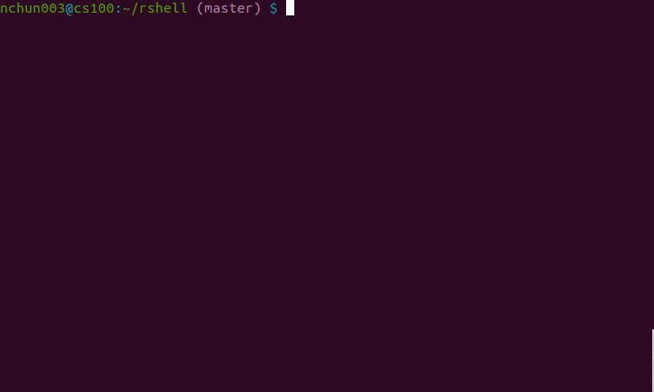

# system call error checking

It is recommended that you perform error checking on every system call ("syscall" for short) your `.c`/`.cpp` you employ.
With proper error checking, if any of your syscalls return an error value, there will be a message telling you why it did.
To do this, you would include the `stdio.h` library to use the `perror` function inside the conditional statement as shown in the example below:
```
	if (-1==execvp(argv[0],argv)) {
		perror("execvp");
		exit(1);
	}
```
It is also good practice to pass in the name and line number of the corresponding syscall as `perror`'s argument.
It would help you identify which syscall returned an error value.

## the `checksyscalls.sh` script

For lengthy source files that have many syscalls, the `checksyscalls.sh` script allows you to keep track of all of them quickly.
This script takes in `.c`/`.cpp` files as its arguments.
However, if you pass in a directory, it will call itself recursively for each said file inside that directory.

To use the script, you would run:
```
$ checksyscalls.sh directory/filename
```

 
As shown in the gif above, this script makes a list of all the syscalls in your source files with the associated line number and `perror` function.
You will know you've done error checking when the next line after the syscall is the `perror` function.
The summary below the list tells you the total of syscalls and `perror` functions you used, and the total grade penalty that you will receive for every syscall you did not do error checking on.
If your instructor enforces it, then the grade penalty should be an incentive to practice error checking!
