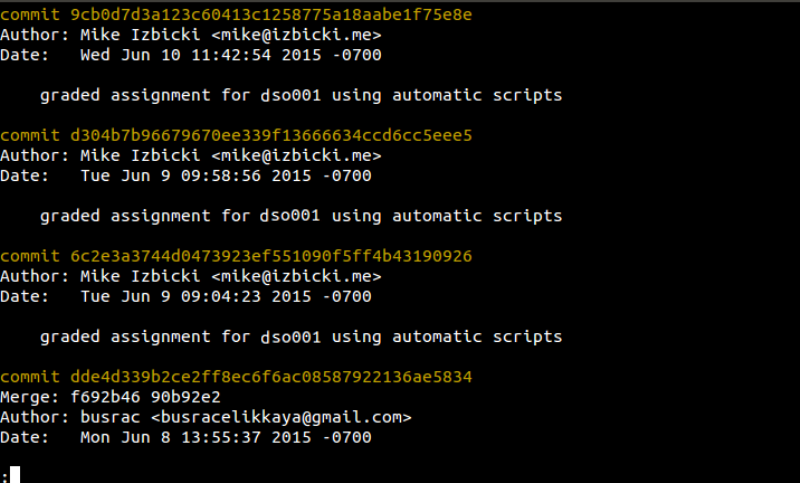

# how gitlearn stores grades

Every class has an associated repository.
This repo contains all the information about the class.
Inside this repo is a folder called `assignments`;
every subfolder of `assignments` corresponds to an assignment in the course.
Inside each folder is a file called `grade`.

Every student maintains their own copy of the class repository.
The student's grades are recorded in the `grades` branch of their repo.
This is done by modifying the `grade` file that corresponds to the assignment.

An example `grade` file might look like:

```
90 / 100

-5 points for making mistake X

-20 points for not doing task Y

+15 points extra credit for doing Z
```

The first line specifies how many points you earned on the assignment,
and how many points the assignment is out of.
The rest of the file gives a detailed breakdown of why your assignment earned that final grade.

If the assignment has not yet been graded, then the `grade` file will contain just a slash and the number of points the assignment is worth:

```
/ 100
```

## checking your overall grade

You can use the `calcgrade.sh` script to calculate your whole grade for the course.
This script automatically downloads the latest version of your grades repo, inspects the grade you received on each assignment, and calculates your current and final grades for the course.

The `calcgrade.sh` script expects a single argument that corresponds to the UCR netid/CS account of the grade you want to check. If no argument is given, `calcgrade.sh` uses the currently logged in user.
Below is an example of how you would run this script (and the output) if you want to find the grade of a student account:


Notice that ungraded assignments are marked with a grade of `---` and not included in the running total.

## cheating

All of your grade information will be stored in your own git repository.
You have write access to this information, so you may be tempted to change it.
Don't!

We have access to the full changelog of all the files in your repo.
For example, if I run the command:
```
$ git log -- [source folder path]/[folder assignment name]/grade
```
or  
```
$ git log -- hw/hw1-rshell/grade
```

Then I will get output similar to:



This tells us who has modified the file and what they've done.
If you modify your grades, we will catch you.

If you are an advanced git user, you may be aware that it's possible to commit changes under other people's names using the `--author` flag.
All of our grading scripts, however, sign the commits we make using the RSA public key crypto system.
Since you do not have access to the instructors' private keys, you will not be able to properly sign the grading commits.

**IMPORTANT:**
I encourage you to try to "hack" this grading system.
And if you find a way to change your grades in any way, I will give you a considerable amount of extra credit in this course.
But please do it responsibly and let the instructors know what you're doing before you try.

**IMPORTANT:**
If you did not give all of the instructors write access to your repository (make them collaborators on github), then you won't be able to get your grades updated, and you will get zeros on the assignments!

**IMPORTANT:**
By default, github sets your repo to `public` and gives everyone read access.
That means everyone can view your grade.
If you do not want others to view your grade, you can set your repo to be `private` instead.
This won't affect our ability to grade your assignments.
