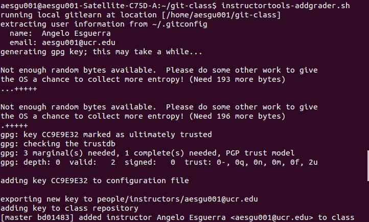

# Adding a new Instructor key

After setting up gitlearn onto your local repository along with your class files,
it is neccessary to add the instructor keys so that student grades can be verified and the grader tools can be accessible.  
On the home directory of the class repository, run: 
```
$ instructortools-addgrader.sh
```



**NOTE:**
It will take time for your system to generate a strong RSA key that will be automatically push to the github repository. 
Expect somewhere around 15~ minutes (depending on your current hardware).

**NOTE:**
The key will automatically push itself onto the main repository.  
Make sure you have your instructors setup on the contributor setting for the repository.

**IMPORTANT:**
Make sure you generate the key on the computer that you will grade on.

