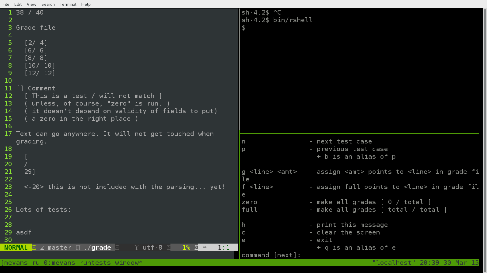

# semi-automatic grading

The `runtests` script makes it easier to test and grade terminal programs.
It is specifically designed for the complex, loosely specified assignments that are common in upper division computer science courses.

## using runtests

You start the tests by running:
```
$ runtests.sh program testfile gradefile
```
where `program` is the executable you want to test;
`testfile` describes the test cases that will be passed to `program`;
and `gradefile` describes the scoring criteria.
This command opens a [tmux session](http://en.wikipedia.org/wiki/Tmux) with three panes.
It looks something like:

The top-right pane displays the current test case and `program`'s output.
The bottom-right pane displays a list of commands that we can enter.
The left pane displays the contents of `gradefile`.

## format of `testfile`

Each line of `testfile` corresponds to a single test case that will be passed to `program`.

## format of `gradefile`

The top line of `gradefile` contains the student's score.

<!--
## What runtests does

In the left pane, ``vim`` is open and editing a grade file.
The grade file is always assumed to be in the current directory.
The line numbers are turned on so it's easier to grade the assignment.
All other default ``vim`` settings are preserved.

In the upper-right pane ``shell`` is run inside of ``sh``.
``sh``'s children are checked every time a command is sent to the ``shell`` pane.
If ``sh`` doesn't have any children, ``Control-C`` is sent to the ``shell`` pane to get rid of any lingering text (possibly from user's interference).
Then, ``shell`` is typed and run.
If ``sh`` has no children at this point, you are notified of the failure and sending test cases becomes disabled.

``runtests`` will start focused on the controller in the bottom-right pane.
The controller accepts commands that are interpreted to change the grade file or to run test cases in the ``shell`` pane.

## Usage
All parameters are optional.

* ``shell`` can be any shell (``bin/rshell``, ``sh``, ``bash``, ``ksh``, etc).
It defaults to ``bin/rshell``

* ``testCaseFile`` is the path to the test cases to load at startup.
It is possible to load test using the controller.
Only one file's test cases may be loaded at a time.

## Features
When ``runtests`` is started, three panes are created in the terminal.
On the left, ``vim`` edits the ``grade`` file in the current directory.
In the upper-right, the ``shell`` is started.
On the bottom-right, the runtests controller awaits commands.
The runtests controller is used to interact with the ``vim`` and ``shell`` panes.
If necessary, the other panes can be controlled manually by clicking on them to bring them into focus.


#### Controlling the Shell Pane
* ``n`` or ``next`` goes to the next loaded test case.
* ``p`` or ``previous`` or ``b`` or ``back`` goes to the previous loaded test case.
* ``l`` or ``load`` and then a filename loads a test case file.
The previously loaded test cases are discarded.

  ###### Special Features:
  * If ``shell`` isn't running in the shell pane, it is restarted.
    * this allows for multiple ``exit`` commands in the same test file.
    * the grader is notified when ``shell`` is restarted.
  * If ``shell`` is suspended, the controller will attempt to make it continue.
  For this feature to work properly, ``sh`` must have job control enabled.

#### Controlling the Vim Pane
* ``g`` or ``grade`` followed by ``<line>`` ``<amt>`` puts ``<amt>`` as a grade on ``<line>``. If ``<line>`` isn't a properly-formatted grade line, nothing happens
* ``f`` ``<line>`` puts a full score on ``<line>``. If ``<line>`` isn't a properly-formatted grade line, nothing happens.
* ``zero`` makes all scores ``0``
* ``full`` makes all scores maximum

  ###### Special Features:
  * After every update, the total is adjusted

#### Controlling the Runtests Controller Pane
* ``h`` or ``help`` or ``h?`` or ``?h`` or ``?`` or ``??`` print a small help message.
* ``c`` or ``clear`` clears the controller screen
* ``e`` or ``exit`` or ``q`` or ``quit`` terminate the ``tmux`` session (closes everything)

  ###### Special Features
  * Upon receiving ``SIGINT``, ``SIGQUIT``, ``SIGTERM``, or ``SIGTSTP``, the controller terminates the session
  * The session terminates when ``read`` exits with an error.
    ``read`` will exit with an error value when the user types ``Control+D`` after nothing else when prompted for a command.
  * Focus can be shifted from the controller to either the vim instance or the shell instance for manual manipulation by using the mouse.
  * Pressing enter without entering a command runs the previous command (useful for speeding through test cases)
  * Displays the previous command in the prompt

## Test Case Format
Whatever you type in a test case file (newlines and all) will be sent to the ``shell``.
See the [``exampleFolder/``](./exampleFolder) for example test case files.

## Gradefile Format
The gradefile format is very lenient.
The first line is always the total score (or nothing) out of the total possible points for a given assignment.
After that, anything can go in the file.
The only lines that are parsed for grades follow this format:

``[<value>/<value>]``

Anything can go before the ``[`` and after the ``]``.
Also, any amount of whitespace (excluding newlines) can go before or after the ``<value>``.
``<value>`` is made up of numbers and an optional period, and always starts with a number.

## Walkthrough
This walkthrough will cover the basic features of ``runtests``.

Run ``runtests`` like the following.
```
./runtests bin/rshell exampleFolder/exampleTestCaseFile
```
It should be run in the ``runtests`` folder of the ``gitlearn`` repository.

Start ``runtests``.
You'll notice the grade file is open on the left, an example ``rshell`` is open in the upper-right, and the selected pane is the controller in the bottom-right.
The controller starts by letting you know if your test case file was successfully loaded and printing the commands available to you.

Step through two test cases by pressing ``Enter`` twice.
This takes advantage of previous command repeating feature.
If you don't specify a command to run, the previous controller command is rerun.
Now run the previous test cases by typing ``previous`` and hitting ``Enter``.
Do this three times.
The controller does bounds checking so you don't accidentally run more test cases than the amount that exist.

Step forward four times (``next``).
Space is preserved by the controller, and the text is sent very quickly.

Step through one more case, and...
Oh no!
Our ``bin/rshell`` has finished!
Run the next test case.
The controller realized that our ``shell`` had finished, so it was restarted.
Also, you were notified that the ``shell`` needed to be restarted.

Step throught the next case.

This one stops the shell. How is it handled? Try the last case to find out.

The controller attempts to bring the stopped process back using job control.

Trying to run more cases yields an error:
there are no more test cases.

Now it's time to start grading.
First, zero out all of the grades with ``zero`` because no points have been earned yet.
Let's give the student a full grade for the objective on lines 5 and 7:
```
f 5
f 7
```
They recieve 4 points for the objective on line 6:
```
g 6 4
```
And 11 points for each of 8 and 9:
```
g 8 11
g 9 11
```

If you wanted to give a full grade to every line in the file, run ``full``.

To stop running ``runtests`` type ``exit`` and hit ``Enter``.
-->
